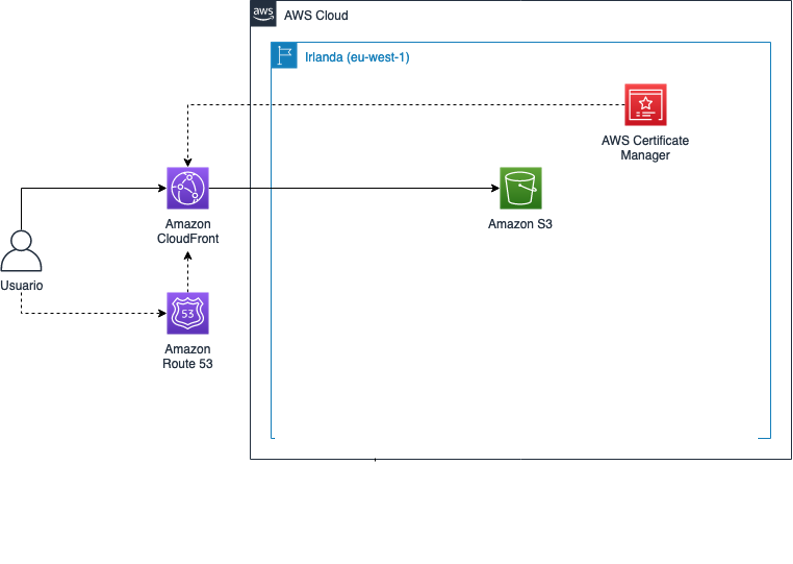
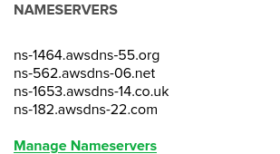

{}
Guión basado en https://aws.amazon.com/es/blogs/aws-spanish/como-alojar-tu-sitio-web-estatico-en-amazon-s3-y-amazon-cloudfront/
## Aprenderás:
* Cómo alojar un sitio web estático en Amazon S3
* Cómo configurar Amazon CloudFront para que sirva el contenido de Amazon S3
* Cómo configurar Amazon Route 53 para que resuelva los nombres de dominio de tu sitio web
* Cómo configurar tu sitio web para que se sirva a través de HTTPS
* Enlazar el nuevo suddominio con CloudFront
* Manejar S3 y CloudFront con AWS CLI
* Invalidar páginas del caché de CloudFront
{}

# Cómo alojar un sitio web estático en Amazon S3, Amazon CloudFront y Route 53

## Motivación

Hoy en día es muy habitual tener que servir algún tipo de sitio web estático, desde sencillas páginas web para que tus clientes puedan conocerte hasta complejas aplicaciones basadas en frameworks como React, Vue.js o Angular. En un escenario tradicional, este contenido se ofrecería desde un servidor web como Apache o NGINX ejecutándose, por ejemplo, en una instancia de Amazon EC2. Por lo tanto, el operador de la infraestructura debe encargarse de tareas como la configuración de los servidores y de la aplicación de parches y actualizaciones, y asegurarse de que hay redundancia para seguir respondiendo peticiones aunque alguna de las máquinas tenga algún problema.

En este artículo veremos cómo utilizar nuestro servicio de almacenamiento de objetos, Amazon S3, y nuestra red de entrega de contenido (CDN), Amazon CloudFront, para liberarte de esa carga de trabajo y servir tus aplicaciones y sitios estáticos de manera eficiente, segura, rápida y económica. Además, haremos uso de Amazon Route 53 para gestionar los registros DNS.

Descripción del escenario

* Queremos crear un sitio web estático
* El sitio debe alojarse de manera sencilla y requerir el mínimo esfuerzo de operación por nuestra parte.
* El sitio debe poder visitarse a través de HTTPS usando nuestro propio dominio 
> Recuerda que tienes que crear tu propio dominio en name.com usando la promoción del student pack de github
* El sitio debe estar disponible el máximo tiempo posible (alta disponibilidad).
* El sitio debe servirse con baja latencia a todos nuestros clientes, que se encuentran repartidos por todos los países de habla hispana.
* El sitio debe ser fácil de actualizar, de manera que podamos cambiar el contenido sin tener que preocuparnos por la infraestructura.

El siguiente diagrama muestra la arquitectura de la solución:


## Alojamiento del sitio en Amazon S3

> Amazon S3 es el servicio de almacenamiento de objetos de AWS, que permite guardar y acceder a cualquier tipo de fichero de hasta 5 TB de tamaño de manera segura a través de una API. Los clientes no tienen que gestionar ningún tipo de servidor. Internamente, Amazon S3 se encarga de almacenar múltiples copias del objeto en diferentes Zonas de Disponibilidad dentro de la región seleccionada, razón por la que ofrece una durabilidad que alcanza los 11 nueves (99.999999999%).

La unidad lógica de almacenamiento en S3 es el bucket. El primer paso consiste en crear un bucket, dentro del cuál subiremos los archivos de nuestra web. Recuerda que en los lab usamos la región us-east-1.

### Pasos
* Dirígete a la consola de administración de Amazon S3.
* En la lista de buckets, haz click en Create bucket.
* Dale un nombre arbitrario a tu bucket (recuerda que los nombres deben ser únicos dentro de S3 de manera global). Puedes dejar el resto de opciones como están.
* Haz click en Create bucket.
* Ve a la vista de detalle del bucket. Haz click en Upload y sube los ficheros de tu web.

> Ahora mismo, estos objetos son privados y no son accesibles por ningún usuario excepto nosotros. Este es el comportamiento por defecto de S3, aunque los clientes pueden ajustar los permisos de manera granular (idealmente, siguiendo siempre el principio de mínimo privilegio).

S3 ofrece una característica que permite acceder a los objetos de un bucket como si se tratara de un servidor web. Técnicamente esta solución nos podría servir, pero entonces obligaríamos a todos nuestros clientes a acudir a nuestro bucket, que está en la región de us-east-1. Un usuario de Europa lo tendría muy lejos. Incumplimos uno de los requisitos que nos propusimos al inicio. Sin embargo, tenemos otras opciones.

## Uso de Amazon CloudFront para servir el sitio

Las redes de entrega de contenidos (content delivery network, CDN) son servidores distribuidos por todo el mundo que actúan como caché para cierto contenido web, idealmente contenido estático que no varía de manera frecuente. Cuando un cliente visita un sitio que se sirve a través de una CDN, su petición acude primero a su caché local (que debería estar muy cerca de él, en su mismo país o incluso en la ciudad). Si el contenido no se encuentra en la caché, la CDN solicita el contenido al origen, lo devuelve al cliente y lo almacena en la caché. A partir de ahí, las peticiones de otros clientes se servirán desde la propia caché mientras el objeto siga ahí, reduciendo de manera notable la latencia de respuesta.

**Amazon CloudFront** es el servicio de CDN de AWS. Con más de 220 puntos de presencia (PoPs) en todo el mundo, podemos usar CloudFront para servir nuestro contenido a usuarios de manera global con una latencia baja, usando el bucket de S3 que creamos previamente como origen. Para ello tenemos que crear una distribución.

### Pasos
1. Ve a la consola de administración de Amazon CloudFront.
1. En la lista de distribuciones haz click en Create Distribution, y luego selecciona una distribución Web.
1. En Origin Domain Name, introduce el nombre de dominio de tu bucket completo, por ejemplo `mi-bucket-de-daw.s3-us-east-1.amazonaws.com`.
1. En Restrict Bucket Access selecciona Yes.
1. En Origin Access Identity escoge Create a New Identity.
1. En Grant Read Permissions on Bucket selecciona Yes, Update Bucket Policy.
1. En Viewer Protocol Policy escoge Redirect HTTP to HTTPS.
1. En Default Root Object introduce el archivo correspondiente, en principio `index.html`.
1. Haz click en Create Distribution.

> Con los pasos 4, 5, y 6 nos aseguramos de que sólo CloudFront puede acceder a los objetos de S3, mediante una identidad de acceso a origen (origin access identity, OAI). Un cliente llamando directamente al bucket de S3 vería su acceso denegado.

La distribución tiene que desplegarse ahora. Tras unos minutos, la distribución pasará a estado **Deployed**. Si visitas la URL que aparece bajo la columna Domain Name, verás tu web.

## Dominio personalizado

Ya tenemos la distribución de CloudFront sirviendo nuestra web por todo el mundo. Sin embargo, el dominio por defecto que CloudFront nos asigna (ab12cd34ef56gh.cloudfront.net) no es, digamos, muy atractivo. Sería ideal poder usar nuestro propio dominio (por ejemplo, www.anycompany.example).

**Amazon Route53** es el servicio de AWS para adquirir y gestionar nombres de dominio. Con un SLA del 100%, a través de Route 53 podemos configurar registros DNS que resolverán nuestro dominio a las IPs adecuadas. Además, usaremos AWS Certificate Manager (ACM) para generar de manera gratuita un certificado TLS para nuestro dominio, que asociaremos a CloudFront para poder servir tráfico HTTPS. De nuevo, esto se hará fácilmente y sin tener que gestionar servidores ya que se trata de servicios totalmente gestionados.

### Creación de una hosted zone en Amazon Route 53

Con los Learner Lab no podemos adquirir dominios, pero sí gestionarlos.

En Amazon Route 53 todos los registros DNS pertenecientes a un dominio se configuran en una hosted zone. El primer paso es, por lo tanto, crear una:

Dirígete a la consola de administración de Amazon Route 53.
* En el menú de la izquierda, haz click en Hosted zones.
* En la lista de hosted zones, haz click en Create hosted zone.
* En Domain name introduce el dominio raíz que quieres gestionar (el que hayas adquirido en `name.com`).
* Asegúrate de que el tipo es Public hosted zone, y haz click en Create hosted zone.

Todas las hosted zones vienen con un registro NS. Éste contiene los servidores de nombres autoritativos para esta hosted zone a los que debes apuntar desde tu registrador, en caso contrario los cambios que realices a continuación no tendrán efecto. En `name.com` ve a `manage nameservers` del dominio que has registrado y cambia los servidores de nombres por los que te proporciona Route 53.
> 

### Creación de un registro DNS hacia la distribución de Amazon CloudFront

En la vista de detalle de la hosted zone de `route53`, sigue estos pasos para añadir un registro DNS que permita resolver nuestro subdominio a la distribución de CloudFront:

* Haz click en Create record, selecciona Switch to wizard y escoge Simple routing.
* Haz click en Define simple record.
* En Record name, escribe el prefijo del subdominio. En nuestro caso, www.
* En Value/Route traffic to selecciona Alias to CloudFront distribution, e introduce el dominio de tu distribución (similar a “ab12cd34ef56gh.cloudfront.net”) en el campo Choose distribution.
* Haz click en Define simple record, y a continuación en Create records.

Si ahora resuelves el subdominio completo con una herramienta como `nslookup` o `dig`, verás que Route 53 proporciona un conjunto de IPs correspondientes al PoP de CloudFront más cercano a ti.

### Creación de un certificado TLS con AWS Certificate Manager

Antes de poder servir tráfico HTTPS usando nuestro dominio personalizado necesitamos crear un **certificado TLS**. `AWS Certificate Manager (ACM)` permite generar certificados de manera gratuita. Además, ACM se encarga de aplicarlos a servicios como CloudFront e incluso de renovarlos automáticamente antes de la fecha de expiración. Una vez más, de forma totalmente gestionada.

Antes de emitir el certificado, ACM comprobará que nosotros somos los propietarios del dominio. ACM se integra con Route 53 para crear automáticamente los registros DNS necesarios, haciéndolo si cabe aún más sencillo:

* Ve a la consola de administración de AWS Certificate Manager.
* En la lista de certificados, haz click en Request a certificate.
* Selecciona Request a public certificate y haz click en Request a certificate.
* En Add domain names escribe el subdominio que hemos registrado en Route 53 (en nuestro ejemplo, www.anycompany.example) y haz click en Next.
* Selecciona DNS validation y haz click en Next.
* Haz click en Review, y posteriormente en Confirm and request.
* El dominio estará en el estado Pending validation. Para añadir automáticamente los registros de Route 53 necesarios para que ACM los valide, despliega el detalle del dominio y haz click en Create record in Route 53.
* Haz click en Create tras revisar el registro que será creado.
* Por último, haz click en Continue.

Tras pocos minutos, el certificado pasará al estado `Issued` y ya podrá usarse en CloudFront.

### Modificación de la distribución de Amazon CloudFront para usar nuestro dominio

El último paso consiste en modificar la distribución de CloudFront para que acepte tráfico dirigido a nuestro dominio:

Ve, de nuevo, a la consola de administración de Amazon CloudFront y selecciona la distribución creada previamente.
* En la pestaña General, haz click en Edit.
* En el campo Alternate Domain NAmes (CNAMEs), que antes dejamos en blanco, añade tu dominio (en nuestro caso, www.anycompany.example).
* En SSL Certificate, escoge Custom SSL Certificate (example.com), y en el campo de texto selecciona el certificado que has creado en ACM.

Cuando el cambio se propague a todos los PoPs, podrás visitar el sitio web con el dominio personalizado.

## Despliegue automático de cambios y cache busting
> Esta parte la haremos en otra práctica

## Despliegue con el cliente de AWS CLI

### Subir archivos a s3

```bash
# Listado de buckets
aws s3 ls
# Copiar archivos al bucket. En mi caso:
aws s3 cp index.html s3://exhibit-lmorillas/
```

### Invalidar cache de cloudfront

La caché de cloudfront [se puede configurar](https://docs.aws.amazon.com/AmazonCloudFront/latest/DeveloperGuide/Expiration.html) para que expire cada cierto tiempo, pero también podemos [invalidar la caché](https://docs.aws.amazon.com/AmazonCloudFront/latest/DeveloperGuide/Invalidation.html) de forma manual. Por defecto los objetos estarán 24 horas. Pero si hacemos un cambio y queremos que se vea inmediatamente, podemos invalidar la caché.

Ejemplo con AWS CLI:
```bash
# Listado de distribuciones de cloudfront
aws cloudfront list-distributions
# crear invalidación. Fíjate el el id de la distribución
aws cloudfront create-invalidation --distribution-id ET29UE5BESTWD --path "/index.html"
```
